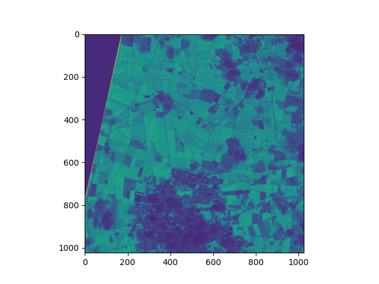

# Generators and Remote Sensing

Over the past few days, several references to
Python generators have appeared in my feed. A while back, I thought it would be interesting
to write about this topic, but as it applies to something more closely related to my work:
the processing of raster geographic data.

Following the learning philosophy of [FastAI](https://www.fast.ai/),
I want to start with the central idea before getting into the details: the
goal here is to be able to process large volumes of geographic data
efficiently, especially when we don’t have enough memory
to load everything at once.

And this is where generators come in[^1].

A generator is a special type of function in Python that uses the
keyword *yield*. This keyword allows for something quite interesting: pausing the
function’s execution and resuming it later from the same point.

In practice, this means we don’t need to load all the data
into memory at once. Instead, we can process it bit by
bit, which is essential when working with large satellite images
that can easily exceed the available RAM.

Here’s a simple example of a generator in Python:

``` python
def generator_function():
    for element in range(5):
        yield element


def main():
    g = generator_function()

    print(next(g))  # 0
    print(next(g))  # 1
    print(next(g))  # 2
    print(next(g))  # 3
    print(next(g))  # 4
    print(next(g))  # StopIteration


if __name__ == "__main__":
    main()
```


What's going on here?

-   The function uses *yield* instead of return
-   We create a generator called "g"
-   We can retrieve values one by one using next()
-   When there is no more data, Python raises an exception called
    StopIteration

This may seem simple, but it's extremely powerful when
applied to real data.

---

Now let’s look at an example closer to remote sensing.

First, let’s check the size of a Sentinel-2 satellite image:


``` bash
du -sh .../B02.jp2
```

In this case, we're talking about an image that's about 70 MB (and
that's just one strip).

The problem is that if we try to load the entire image into memory many
times, we could easily run out of RAM.

That’s why, instead of reading the entire image at once, we’re going to process it
in chunks (1024 × 1024-pixel windows) using Rasterio.

``` python
from pathlib import Path
import numpy as np
import rasterio as rio


def read_raster_file_by_windows(filename):
    if filename.exists():
        with rio.open(Path(filename)) as raster:

            num_windows = len(list(raster.block_windows(1)))
            yield num_windows

            for _, window in raster.block_windows(1):
                yield raster.read(window=window)


def main():
    file_b4 = "..._B04.jp2"
    file_b8 = "..._B08.jp2"

    raster_b4 = read_raster_file_by_windows(file_b4)
    raster_b8 = read_raster_file_by_windows(file_b8)

    n_windows = next(raster_b4)
    next(raster_b8)

    for b4, b8 in zip(raster_b4, raster_b8):
        b4 = b4 / 10_000
        b8 = b8 / 10_000

        ndvi = (b8 - b4) / (b8 + b4 + 1e-10)

        print(ndvi.mean())


if __name__ == "__main__":
    main()
```

The key idea here is simple:

Instead of processing the entire image, we divide it into small blocks and
process them one by one.

This allows us to work with images much larger than the available
memory.

And we get a result like the one shown in the following image:




---

Now here’s an important question: How do we save the result if
we’re processing in chunks?

To do that, we can combine windowed processing with parallelization.

The idea is simple:

-   We divide the image into blocks
-   We process each block in parallel
-   We safely write the result to disk

``` python

import concurrent.futures
import multiprocessing
import threading
from contextlib import nullcontext

import rasterio
import numpy as np
from rasterio.env import GDALVersion


def main(infile_1, infile_2, outfile, num_workers=4):
    """Process infile block-by-block and write to a new file

    The output is the same as the input, but with band order
    reversed.
    """
    gdal_at_least_3_11 = GDALVersion.runtime().at_least("3.11")
    with rasterio.open(
        infile_1,
        driver="LIBERTIFF" if gdal_at_least_3_11 else None,
        thread_safe=gdal_at_least_3_11,
    ) as src_1:
        with rasterio.open(
            infile_2,
            driver="LIBERTIFF" if gdal_at_least_3_11 else None,
            thread_safe=gdal_at_least_3_11,
        ) as src_2:
            # Create a destination dataset based on source params. The
            # destination will be tiled, and we'll process the tiles
            # concurrently.
            profile = src_1.profile
            profile.update(blockxsize=1024,
                           blockysize=1024,
                           tiled=True,
                           driver="GTiff")

            with rasterio.open(outfile, "w", **profile) as dst:
                windows = [window for ij, window in dst.block_windows()]

                # We cannot write to the same file from multiple threads
                # without causing race conditions. To safely read/write
                # from multiple threads, we use a lock to protect the
                # DatasetReader/Writer
                read_lock = threading.Lock() if not gdal_at_least_3_11 else nullcontext()
                write_lock = threading.Lock()

                def process(window):
                    with read_lock:
                        src_array_1 = src_1.read(window=window)
                        src_array_2 = src_2.read(window=window)

                    # The computation can be performed concurrently
                    result = np.divide(
                        (src_array_2 - src_array_1), (src_array_2 + src_array_1),
                        out=np.zeros_like(src_array_1, dtype=float),
                        where=(src_array_2 + src_array_1)!=0
                    )


                    with write_lock:
                        dst.write(result, window=window)

                # We map the process() function over the list of
                # windows.
                with concurrent.futures.ThreadPoolExecutor(
                    max_workers=num_workers
                ) as executor:
                    executor.map(process, windows)


if __name__ == "__main__":

    filename_banda_4 = "~/T18NUJ/S2A_MSIL1C_20260109T152711_N0511_R025_T18NUJ_20260109T184450.SAFE/GRANULE/L1C_T18NUJ_A055106_20260109T152714/IMG_DATA/T18NUJ_20260109T152711_B04.jp2"
    filename_banda_8 = "~/T18NUJ/S2A_MSIL1C_20260109T152711_N0511_R025_T18NUJ_20260109T184450.SAFE/GRANULE/L1C_T18NUJ_A055106_20260109T152714/IMG_DATA/T18NUJ_20260109T152711_B08.jp2"
    main(
        infile_1=filename_banda_4,
        infile_2=filename_banda_8,
        outfile="/home/juanse/Documents/ext_data/tmp/exportado.TIF",
        num_workers=16)
```

Here’s an important concept: parallel processing.

But when multiple processes try to write to a
file at the same time, problems known as **race conditions** can occur,
which can corrupt the data.

That’s why we use locks, which basically ensure that only one
process can write to or read from a critical section at a time.


---

And with that, we wrap up the main idea:

-   Generators allow us to work with large datasets without loading
    everything into memory
-   Window-based processing makes it possible to work with
    huge satellite images
-   and parallelization allows us to speed up these processes without losing
    control over the data

In the next post, I’ll show how to extend this idea to perform
inference with neural networks on satellite images at a large
scale.


---

# Footnotes

[^1]: <https://github.com/dabeaz/generators/blob/master/Generators.pdf>
