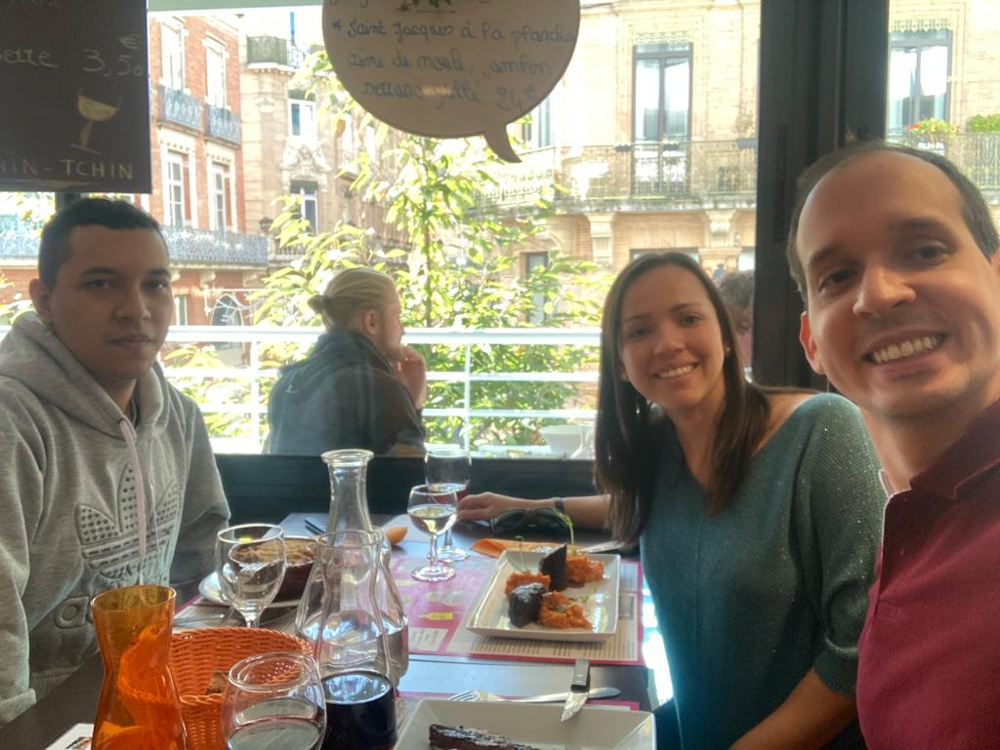

# About

Juan Sebastián Vinasco Salinas

https://jsvinasco.github.io/ | https://github.com/JSVinasco | https://gitlab.com/JSVinasco

es >= en ?

Soy estudiante de último año de Ingeniería Topográfica en la Universidad del Valle en Colombia, tengo conocimientos en teledetección, procesamiento digital de imágenes, análisis espacial, sistemas de información geográfica y su integración con sensores ambientales. Me interesa trabajar en aplicaciones de teledetección en plataformas satelitales tanto activas como pasivas, y su fusión con la detección in situ de datos ambientales utilizando herramientas de prototipado, como Arduino y Raspberry Pi para su integración en sistemas de información geográfica. Además, combinando lo anterior con técnicas de inteligencia artificial y aprendizaje automático para la monitorización de parámetros biofísicos.

También soy un entusiasta y apasionado del desarrollo de software de código abierto, que es el objetivo de mi licenciatura. Por lo tanto, soy usuario habitual de GRASS GIS (principalmente módulos temporales), Python (Bibliotecas como Numpy, Pandas, SKLearn, Matplotlib, Keras, Pytorch) y R (Keras, Caret, Cast para el modelado espacio-temporal). Además, he trabajado con tecnología de Contenedores bajo la plataforma Docker, y su ejecución en un cluster basado en la tecnología HTCondor.

-------------------

en >= es?

I am a senior student in Topography Engineering at Universidad del Valle in Colombia, I have knowledge in remote sensing, digital image processing, spatial analysis, geographic information systems and their integration with environmental sensors. I am interested in working in remote sensing applications on both active and passive satellite platforms, and their fusion with in situ sensing of environmental data using prototyping tools, such as Arduino and Raspberry Pi for integration into geographic information systems. In addition, combining the above with artificial intelligence technics and machine learning for the monitoring of biophysical parameters.

I am also an enthusiastic and passionate about open source software development which is the focus of my bachelor's degree. Therefore, I am regular user of GRASS GIS (mainly temporary modules), Python (Libraries like Numpy, Pandas, SKLearn, Matplotlib, Keras, Pytorch) and R (Keras, Caret, Cast for Spatio-temporal modeling). Also, I have worked with Containers technology under Docker platform, and its execution in a cluster based on HTCondor technology.

<!---
This is where you put the contents of your *About* page. Like all your pages, it's in [Markdown](https://guides.github.com/features/mastering-markdown/) format.
-->

