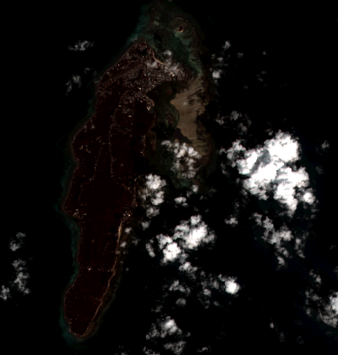

Hello and welcome to this blog. 

## Just a Remote Sensing Blog

Hey mi name is Juan Sebastián Vinasco Salinas.

I am a senior student in Topography Engineering at Universidad del Valle in Colombia,
I have knowledge in remote sensing, digital image processing, spatial analysis,
geographic information systems and their integration with environmental sensors. I am
interested in working in remote sensing applications on both active and passive satellite
platforms, and their fusion with in situ sensing of environmental data using prototyping
tools, such as Arduino and Raspberry Pi for integration into geographic information
systems. In addition, combining the above with artificial intelligence technics and
machine learning for the monitoring of biophysical parameters.

I am also an enthusiastic and passionate about open source software development which
is the focus of my bachelor's degree. Therefore, I am regular user of GRASS GIS (mainly
temporary modules), Python (Libraries like Numpy, Pandas, SKLearn, Matplotlib, Keras,
Pytorch) and R (Keras, Caret, Cast for Spatio-temporal modeling). Also, I have worked
with Containers technology under Docker platform, and its execution in a cluster based
on HTCondor technology.

So in the nexts posts i gonna try to share my knowledge with any person who want to read me.
